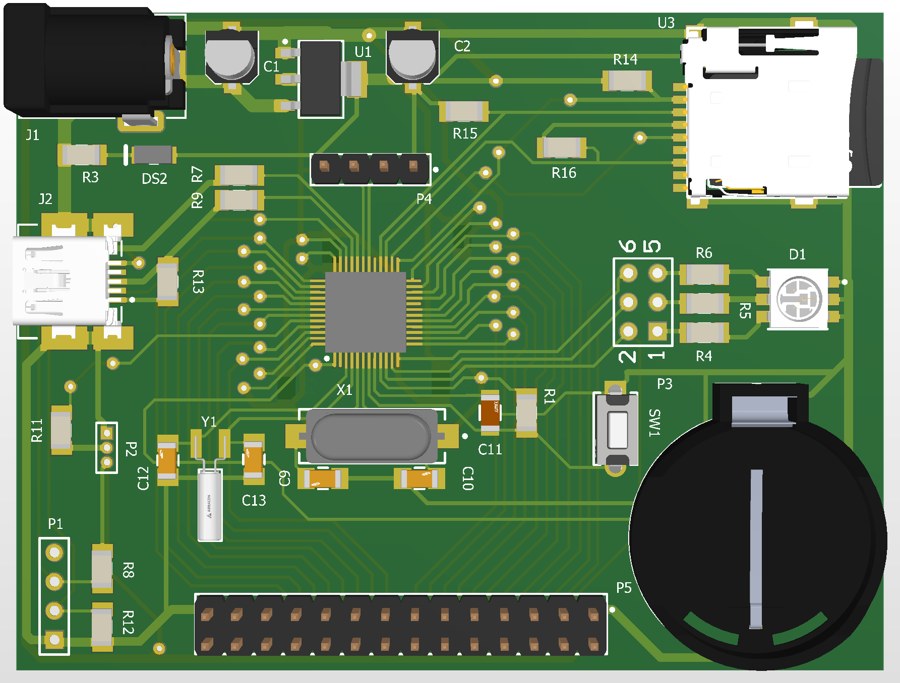

Versatile STM32F103C8T6 Development Board

This project was created to provide a flexible and feature-rich platform for a wide range of embedded projects.

Features:

Expandable Storage: Includes a MicroSD card slot for data logging, file storage, and more.

RTC Support: A backup battery holder (CR2032 or similar coin cells) is included to maintain timekeeping even when the main power is disconnected.

Easy Connectivity: A USB port which is connected to microcontroller's USB peripheral. Pull up resistors are included.

RGB LED: An onboard RGB LED for status indication.

I/O: Multiple headers provide access to GPIO pins for connecting sensors and other peripherals.

Flexible Power: Can be powered via a standard barrel jack. Notice that the board is not powered through USB or SWD, only GND is connected.

If you have the skills and equipment, build the board and test its functionality. I'd be glad to know any bugs in the design!
In case you found an issue, Open a new issue in the repository to let us know. Please be as detailed as possible.
I'd love to hear any improvements as well.

THIS IS A PROTOTYPE PROJECT AND THE HARDWARE HAS NOT BEEN TESTED YET. THERE MAY BE UNKNOWN BUGS OR ERRORS IN THE SHCEMATICS. 
THE AUTHOR AND CONTRIBUTERS OF THIS PROJECT ARE NOT RESPONSIBLE FOR ANY DAMAGE CAUSED BY THIS DESGIN.
